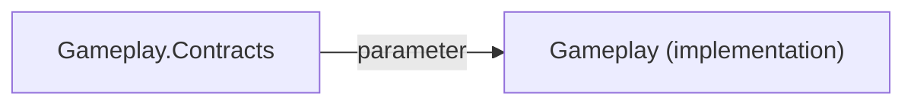

# A2 — Contract depends on a non-contract role

| Field | Value |
|---|---|
| Code | `A2` |
| Class | `invariant` → **[block](../gates/block.md)** |
| Analyzer | `BoundaryAnalyzer` |
| Commands | `map` and `gate` (unless `knownFindings`) |

## When it fires

Same illegal-edge table as [A1](A1.md), but the **source role is `contract`**. That includes:

- Contract → foreign **implementation / infrastructure / ui**
- Contract → **its own module's** implementation / infrastructure / ui (the contract must not know the body)
- Contract → foreign **non-shared** non-contract roles

**Legal:** contract → foreign or local **contract**; contract → **shared**.

`contract → contract` across modules is allowed here (navigation DTOs and similar). If a contract **signature** names a type from another non-shared module, that is [A6](A6.md) (trigger), not A2.

Message: `{module} contract depends on {toModule} {toRole}`.

Fingerprint: `ForTypeEdge("A2", fromTypeId, toTypeId, kinds)`.

## Example

```csharp
// Gameplay.Contracts/IScore.cs
public interface IScore
{
    void Use(Account.TokenCache cache); // A2: contract → Account implementation
}
```

Intra-module leak:

```csharp
// Gameplay.Contracts/IScore.cs
public interface IScore
{
    Gameplay.ScoreService Impl { get; } // A2: Gameplay contract depends on Gameplay implementation
}
```



## How to fix

1. Replace the implementation type with an interface or DTO that **lives in a contract or shared** assembly.
2. If the contract needs another feature's API, reference **`Y.Contracts`**, not `Y`.
3. Keep mapping/adapters in the implementation assembly; contracts stay ignorant of EF, HTTP clients, and UI types.

## What not to do

- Do **not** move the implementation class into the contract project to make A2 go away — that becomes [A5](A5.md) (concrete class in contract) and usually [A4](A4.md) surface growth.
- Do **not** use InternalsVisibleTo from Contracts to the body; A2 is about **compile-time type edges**, and A7 will fire for non-test friends.
- Do **not** silence A2 in `knownFindings` for a new edge. A contract that knows a store or ViewModel is a permanent coupling.

See also [A1](A1.md), [A5](A5.md), [A6](A6.md).
