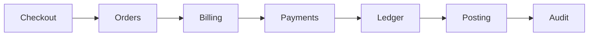

# B6 — Самый длинный путь в конденсации графа модулей достиг `maxModulePath`

| Поле | Значение |
|---|---|
| Код | `B6` |
| Класс | `trigger` → вердикт **[triggers](../gates/triggers.md)**, код выхода 4, если в отчёте гейта нет находок классов `invariant` и `ratchet`; сама по себе находка не блокирует |
| Кто выдаёт | `StaticMetricsCalculator.Calculate` по значению `MaxModulePath` из `CorePathAnalyzer.Compute(graph)` (метод `LongestCondensationPath`) |
| Команды | `map` — находка снимка, попадает в `findings.json` и на вкладку Findings; `gate` — проходит в `gate-report.json`, если её отпечатка нет в `knownFindings` |
| Метрика | [`maxModulePath`](../metrics/maxModulePath.md), чип **maxModulePath** на вкладке Metrics |
| Порог | `gate.maxModulePath` в `arch-lens.yaml`, по умолчанию `6` (`GateOptions.MaxModulePath`); условие `maxModulePath >= порог` |
| Отпечаток | `ForTypeEdge("B6", "", "", [])` — один на весь репозиторий, значение метрики в него **не** входит; `FromModule` и `ToModule` пусты, `Evidence` пуст |
| Сообщение | `maxModulePath {значение} >= {порог}`, например `maxModulePath 6 >= 6` |

## Термины

Базовые понятия — [граф модулей](../glossary.md#module-graph), [компонента сильной связности](../glossary.md#scc) и [конденсация](../glossary.md#condensation) — определены в словаре. Здесь они раскрыты подробнее.

**Конденсация графа** — это граф, в котором каждая компонента сильной связности стянута в один узел. Стягиваются и циклические компоненты, и одиночные модули (для них узел конденсации совпадает с модулем). Ребро между двумя узлами конденсации существует, если хотя бы одно межмодульное ребро соединяет модули из разных компонент; рёбра внутри компоненты исчезают, а несколько рёбер между теми же двумя компонентами склеиваются в одно. Конденсация всегда ациклична: если бы между двумя её узлами существовал цикл, соответствующие компоненты были бы взаимно достижимы и по определению составляли бы одну компоненту. Для детерминизма каждая компонента представлена ordinal-минимальным идентификатором своего модуля.

**Длина пути измеряется в рёбрах**, а не в модулях. Путь `A → B → C → D` проходит четыре узла и три ребра, его длина равна `3`. Ребро — это один шаг распространения: изменение в `D` доходит до `A` за три шага. Такая мера согласована с краевыми случаями: у графа без рёбер длина `0`, а цикл из любого числа модулей — один узел конденсации без рёбер, и его длина тоже `0`. На простой цепочке одиночных модулей `рёбра = модули − 1`.

**Алгоритм** (`LongestCondensationPath`): строятся узлы и рёбра конденсации, затем узлы обходятся в топологическом порядке (алгоритм Кана, при нескольких готовых узлах — ordinal-минимальный), и для каждого узла `v` вычисляется `dist(v) = max(dist(u) + 1)` по всем его предшественникам `u`; у узлов без входящих рёбер `dist = 0`. Результат — наибольшее `dist`. Веса рёбер не участвуют.

## Когда срабатывает

```text
rep(S)        = ordinal-минимальный модуль компоненты S
узлы          = rep(S) для каждой компоненты, включая одиночные модули
рёбра         = rep(from) → rep(to) для каждого межмодульного ребра с rep(from) ≠ rep(to), без дубликатов
dist(v)       = 0 для узлов без входящих рёбер, иначе max(dist(u) + 1) по предшественникам u
maxModulePath = max dist(v), или 0 для пустого графа
B6 ⇔ maxModulePath >= gate.maxModulePath
```

Порог берётся из YAML (`gate.maxModulePath`), по умолчанию `6`; сравнение нестрогое. Цепочка из семи учитываемых модулей даёт длину `6` и срабатывает при пороге по умолчанию, цепочка из шести — длину `5` и не срабатывает.

Два следствия заслуживают отдельного внимания.

1. **Отпечаток постоянен и не содержит значения.** Если находка однажды попала в `knownFindings` при `maxModulePath = 6`, гейт будет молчать и при `7`, и при `12`: отпечаток тот же. Единственный способ сохранить контроль над дальнейшим ростом — принимать через порог в YAML, а не через `knownFindings` (см. «Когда допустимо принять»).
2. **Цикл укорачивает путь.** Компонента любого размера — один узел конденсации, поэтому замыкание цепочки в цикл уменьшает `maxModulePath`. Уменьшение чипа при появлении строки в разделе Cycles — не улучшение: за него отвечают [B1](B1.md) и [B5](B5.md).

Сборки с ролями `host` и `test` в граф модулей не входят, поэтому цепочки, проходящие через корень композиции или тесты, длину не увеличивают (тест `Host_and_test_are_absent_from_core_and_path`).

### Чем B6 отличается от соседей по семейству

| Правило | Вопрос, на который оно отвечает | Отличие |
|---|---|---|
| [B4](B4.md) | Какую долю графа в среднем достигает изменение одного модуля? | B4 — среднее по всем парам и порог в `baseline.json`; B6 — максимум длины и абсолютный порог в YAML |
| [B5](B5.md) | Насколько велика наибольшая циклическая компонента? | B5 растёт, когда цикл становится больше; B6 при этом **падает**, потому что компонента стянута в один узел |
| **B6** | Сколько шагов в самой длинной цепочке зависимостей после стягивания циклов? | — |
| [B7](B7.md) | Есть ли модуль, напрямую связанный со всеми остальными? | B7 — про ширину связей одного модуля, B6 — про глубину цепочки |

## Пример

Юнит-тесты `CorePathAnalyzerTests` фиксируют формулу. Цепочка `A → B → C` даёт `maxModulePath = 2` (тест `Acyclic_module_graph_has_zero_core_and_dag_edge_path`). Цепочка из семи модулей `M0 → M1 → … → M6` даёт `6`, и в `findings.json` появляется находка класса `trigger` с сообщением `maxModulePath 6 >= 6` и отпечатком `ForTypeEdge("B6", "", "", [])` (тест `Condensation_path_of_six_edges_emits_B6`); цепочка из шести модулей даёт `5` без находки (`Condensation_path_of_five_edges_does_not_emit_B6`). При `gate.maxModulePath: 7` семь модулей находки не дают (`Calculator_honors_max_module_path_override`).

Стягивание цикла: рёбра `A → B`, `B → A`, `B → C` дают компоненту `{A, B}` и один шаг до `C`, то есть `maxModulePath = 1`, а не `2` (тест `Cycle_collapses_to_one_condensation_node_on_the_longest_path`). Пара `A ↔ B` без других модулей даёт `0`.

Пример ближе к практике: `Checkout → Orders → Billing → Payments → Ledger → Posting → Audit`, где каждый модуль ссылается только на контракт следующего. Ни одно ребро не нарушает [A1](A1.md), но семь учитываемых модулей образуют путь длиной `6`, и при пороге по умолчанию на вкладке Findings появится строка `maxModulePath 6 >= 6`.



## Где смотреть в отчёте

- **Вкладка Findings** — строка `B6 | trigger | | | maxModulePath 6 >= 6 | ` с пустыми колонками From, To и Evidence. Та же запись — в `findings.json`.
- **Вкладка Metrics, чип `maxModulePath`** — текущая длина целым числом; в `metrics.json` — ключ `maxModulePath`. Чип показывается всегда, независимо от того, сработало ли правило.
- **Вкладка Metrics, раздел Cycles** — если длина внезапно уменьшилась, проверьте, не появилась ли здесь новая компонента.
- **`gate-report.json`** — тот же объект с `"class": "trigger"`, если отпечатка нет в `knownFindings`.
- **`arch-lens.yaml`, ключ `gate.maxModulePath`** — действующий порог; без ключа действует `6`.
- **Какая именно цепочка самая длинная**, отчёт не выводит. Её восстанавливают по колонке Fan-out таблицы Modules и по `graph.json`; на вкладке Matrix сортировка «dependency layers» располагает строки в порядке зависимостей компонент, и длинная «лестница» клеток под диагональю указывает на цепочку, но матрица строится по компонентам из `rules`, а не по модулям (см. [отличие DSM от графа модулей](../glossary.md#dsm-vs-modules)).

## Как исправить

1. Восстановите цепочку и найдите в ней модули-«передатчики», которые только принимают вызов и передают его дальше: именно они добавляют шаги без собственной ответственности.
2. Уберите промежуточные шаги. Если модуль верхнего слоя зависит от модуля нижнего слоя только через цепочку посредников, дайте ему зависеть от контракта нужного модуля напрямую и удалите зависимость посредника, либо перенесите общие типы, ради которых цепочка и тянется, в `shared`: по правилам границ ([A1](A1.md)) модуль `shared` может зависеть только от других `shared`, поэтому ребро в него не продолжает цепочку через функциональные модули.
3. Инвертируйте зависимость портом там, где нижний модуль вызывается лишь для уведомления: верхний модуль объявляет порт, нижний его реализует, ребро разворачивается и цепочка распадается на две короткие. Проверьте после этого раздел Cycles: неудачный разворот может замкнуть цикл.
4. Если несколько соседних сборок в цепочке — на самом деле один модуль (общий владелец, общий цикл выпуска), объедините их идентификатор в YAML (`modules.assemblies[].module`); это честно только для настоящего единого модуля.
5. Проверьте результат командой `arch-lens map`: чип `maxModulePath` должен стать меньше порога.

**Когда допустимо принять.** Если глубокая цепочка отражает настоящий конвейер обработки и укорачивать её не планируется, поднимите `gate.maxModulePath` в `arch-lens.yaml` до текущего значения плюс один и закоммитьте изменение с объяснением: правило продолжит ловить дальнейший рост. Принятие через `arch-lens baseline` тоже заглушит находку, но, поскольку отпечаток не содержит значения, вместе с ней замолчит и любой будущий рост длины; выбирайте этот путь только осознанно.

## Чего не делать

- Не ставьте `gate.maxModulePath: 100`, чтобы сделать CI зелёным: правило перестанет отличать шесть шагов от тридцати.
- Не сливайте независимые по владению и развёртыванию сборки в один идентификатор модуля ради короткого пути: граф модулей будет описывать несуществующую систему.
- Не замыкайте цепочку в цикл, чтобы «укоротить» её: длина упадёт, но появятся [B1](B1.md) и, при трёх и более участниках, [B5](B5.md).
- Не переносите промежуточные вызовы в `host`: сборки `host` не учитываются, и цепочка лишь исчезнет из отчёта.
- Не полагайтесь на `knownFindings` как на способ принять «текущую длину»: отпечаток без значения принимает любую длину сразу и навсегда.

См. также [maxModulePath](../metrics/maxModulePath.md), [propagationCost](../metrics/propagationCost.md), [coreSize](../metrics/coreSize.md), [B1](B1.md), [B4](B4.md), [B5](B5.md).
