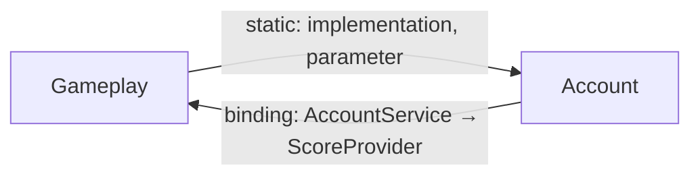

# R1 — Цикл модулей во время выполнения, замкнутый рёбрами `binding` из регистраций DI

| Поле | Значение |
|---|---|
| Код | `R1` |
| Класс | `trigger` → вердикт **[triggers](../gates/triggers.md)**, код выхода 4, если в отчёте гейта нет находок классов `invariant` и `ratchet` |
| Кто выдаёт | `RuntimeAnalyzer.AnalyzeR1`, вызывается из `StaticMetricsCalculator.Calculate` вместе со списком статических циклов `cycles` текущего снимка |
| Команды | `map` (находка снимка: `findings.json`, вкладка Findings), `baseline` (отпечаток попадает в `knownFindings`), `gate` (находка проходит фильтр `knownFindings`; список `knownCycles` на R1 не влияет) |
| Отпечаток | `ForTypeEdge("R1", "A,B,C", "", [])` — идентификаторы модулей компоненты, отсортированные по ordinal и соединённые запятой без пробелов |
| Сообщение | `runtime cycle via DI bindings: A, B, C` — те же идентификаторы через запятую с пробелом |
| Свидетельства | рёбра `binding` между типами разных модулей компоненты: `потребитель → реализация (binding:вес)`; статические рёбра цикла в свидетельства не входят. `FromModule` и `ToModule` пусты |

## Термины

Базовые понятия — [порт, потребитель контейнера и ребро `binding`](../glossary.md#binding-edge), [граф модулей](../glossary.md#module-graph), [компонента сильной связности](../glossary.md#scc), [учитываемый модуль](../glossary.md#scored) — определены в словаре. Здесь они разобраны подробнее, потому что без них находку прочитать нельзя.

**Порт** (`BindingSemantics.IsPort`) — интерфейс или абстрактный класс. Записи, в том числе `abstract record`, портами не считаются, потому что экстрактор присваивает им вид `record`.

**Потребитель контейнера** (`BindingSemantics.IsContainerConsumer`) — тип, который встречается как `service` или `implementation` хотя бы в одной регистрации DI, сделанной не из тестовой сборки. Класс, который нигде не зарегистрирован, контейнер никогда не создаёт, поэтому его конструктор контейнером не разрешается, и его параметры для анализа времени выполнения **не существуют**: такой класс не даёт ни рёбер `binding`, ни находок R1 и [R2](R2.md), ни вклада в метрику [`runtime`](../metrics/runtime.md) (тест `Resolve_skips_unregistered_consumer_even_when_port_is_bound`). Обратная сторона: класс, который создаёт фреймворк или `ActivatorUtilities`, для этих правил тоже невидим.

**Внедрение** (`Injection`) — пара «потребитель, порт» из параметров явно объявленных конструкторов, включая первичные; аргументы обобщённых типов раскрываются (`IEnumerable<IHandler>`, `Lazy<IFoo>`, `Func<IFoo>`). Внедрения лежат в `graph.json` в разделе `bindings.injections`.

**Ребро `binding`** (`BindingResolver.Resolve`) выводится из тройки: потребитель контейнера `C` внедряет порт `S`, а `S` зарегистрирован с известной реализацией `T` из решения, `T ≠ S`, `T ≠ C`. Результат — ребро `C → T` вида `binding` с весом, равным числу различных портов, через которые `C` доходит до `T` (тест `Two_ports_to_one_impl_weigh_2_and_order_is_ordinal`). Регистрации без известной реализации — фабрики, экземпляры, непрозрачные обёртки — рёбер не дают. Признак тестовой сборки проверяется у потребителя, а не у регистрации порта; реализация из тестовой сборки отбрасывается позже, потому что не является учитываемой. Компилятор этих рёбер не видит: статически потребитель зависит от порта, а кто стоит за портом, решает контейнер.

**Граф времени выполнения** — объединение межмодульных рёбер графа модулей (без весов) и рёбер `binding`, спроецированных на модули: ребро `C → T` даёт `модуль(C) → модуль(T)`, если оба модуля учитываемые и различны. Компонента сильной связности размером два и больше в этом графе — **цикл времени выполнения**.

## Когда срабатывает

```text
nodes         = учитываемые модули
edges         = { (m(F), m(T)) : межмодульное статическое ребро F → T }
              ∪ { (m(C), m(T)) : ребро binding C → T, m(C) ≠ m(T), оба модуля учитываемые }
runtimeCycles = SCC размера >= 2 в (nodes, edges), каждая — отсортированный список модулей
R1 для S      ⇔ S ∈ runtimeCycles ∧ ни один статический цикл из metrics.cycles не равен S как множество
evidence(S)   = рёбра binding, концы которых лежат в разных модулях S, по from, затем по to
```

**Почему статически чистый граф может быть циклическим во время выполнения.** Параметр конструктора типа `IScoreProvider` даёт статическое ребро `parameter` в модуль, где объявлен порт, а не в модуль реализации. Инверсия зависимостей для того и нужна, чтобы владелец порта статически не знал о реализаторе. Но контейнер это знание восстанавливает: во время выполнения владелец порта вызывает реализатора. Если реализатор при этом статически зависит от владельца — что разрешено, он реализует его контракт, — стрелки замыкаются. Ребро `binding` делает выбор контейнера явным, а R1 показывает, где этот выбор замкнул цикл.

**Почему R1 не дублирует B1.** Статические циклы — это метрика [`cycles`](../metrics/cycles.md) и правило [B1](B1.md), которое гейт синтезирует по `knownCycles`. R1 пропускает компоненту времени выполнения, если она совпадает как множество с каким-либо статическим циклом (тест `No_R1_when_scc_equals_a_static_cycle`). Остаются компоненты, которые существуют **благодаря** рёбрам `binding`: совсем новые циклы и статические циклы, расширенные регистрациями. Если статический цикл `{A, B}` через регистрацию втянул модуль `C`, гейт выдаст B1 для `{A, B}` и R1 для `{A, B, C}`: это не дубликат, а сообщение о том, что цикл во время выполнения больше, чем виден компилятору.

R1 — находка снимка: её глушит `knownFindings` по отпечатку, в который входит всё множество модулей, поэтому изменение состава компоненты даёт новый отпечаток; `knownCycles` на R1 не влияет. Ограничения экстракции DI (README, раздел «DI bindings»): порядок регистраций и `Replace` не моделируются, ключевые сервисы и локатор сервисов не учитываются, регистрации под `#if` записываются как скомпилированные; фабрики и непрозрачные обёртки рёбер не дают. Поэтому R1 может **недооценивать** число циклов, но не выдумывать их.

## Пример

Юнит-тест `R1_when_binding_closes_a_static_acyclic_pair`: модули реализации `Account` и `Gameplay`. Статическое ребро одно: `Account::A.Impl → Gameplay::G.Consumer`, то есть `Account → Gameplay`. `Gameplay::G.Consumer` внедряет порт `Account::A.I`; регистрации `A.I → A.Impl` и `G.Consumer → G.Consumer` (вторая делает `Consumer` потребителем контейнера). Ребро `binding`: `Gameplay::G.Consumer → Account::A.Impl`, то есть `Gameplay → Account`. В объединённом графе стрелки идут в обе стороны, компонента `{Account, Gameplay}` — цикл, статических циклов нет. Находка: сообщение `runtime cycle via DI bindings: Account, Gameplay`, отпечаток `ForTypeEdge("R1", "Account,Gameplay", "", [])`, свидетельство `Gameplay::G.Consumer → Account::A.Impl (binding:1)`. Тест `Host_and_test_bindings_do_not_create_R1`: потребители из `host` и `test` рёбер между учитываемыми модулями не создают.

Тот же рисунок в коде:

```csharp
// Account.Contracts — порт принадлежит модулю Account
public interface IScoreProvider { int ScoreOf(Guid userId); }

// Account — потребитель контейнера; parameter → Account.Contracts остаётся внутри модуля
internal sealed class AccountService(IScoreProvider scores) { /* … */ }

// Gameplay — реализует чужой порт и зависит от чужого контракта
internal sealed class ScoreProvider(IAccountQuery accounts) : IScoreProvider { /* … */ }
// implementation и parameter → Account.Contracts: статическое ребро Gameplay → Account (разрешено)

// App.Host — корень композиции
services.AddSingleton<AccountService>();
services.AddSingleton<IScoreProvider, Gameplay.ScoreProvider>();
// ребро binding: AccountService → ScoreProvider, то есть Account → Gameplay
// статический граф: Gameplay → Account — ацикличен, B1 молчит
// граф времени выполнения: Gameplay → Account → Gameplay — R1
```



## Где смотреть в отчёте

- **Вкладка Findings** — строка `R1 | trigger | | | runtime cycle via DI bindings: A, B | C → T (binding:вес), …`; колонки From и To пусты. Тот же объект в `findings.json`.
- **Вкладка Metrics, раздел Runtime (DI)** — строки `resolvedEdges` (число рёбер `binding`) и `interModuleWeight` (их суммарный вес между разными модулями), а под таблицей — список **всех** циклов времени выполнения, включая совпадающие со статическими, либо надпись `no runtime cycles`. В `metrics.json` это `runtime.resolvedEdges`, `runtime.interModuleWeight`, `runtime.cycles`.
- **Вкладка Metrics, раздел Cycles** — статические циклы; сравнение двух списков показывает, какие компоненты замкнуты только регистрациями.
- **Вкладка Matrix, переключатель `resolve DI`** — добавляет рёбра `binding` в матрицу; клетки, появляющиеся только с включённым переключателем, — это выбор контейнера. Матрица строится по компонентам, а не по модулям, см. [отличие DSM от графа модулей](../glossary.md#dsm-vs-modules).
- **`graph.json`** — `bindings.registrations` (`service`, `implementation`, `shape`, `registrar`, `location`) и `bindings.injections` (`consumer`, `service`): по ним восстанавливается тройка, породившая каждое свидетельство.
- **`gate-report.json`** — та же находка, если её отпечатка нет в `knownFindings`.

## Как исправить

1. По свидетельствам определите тройку: какой потребитель, через какой порт, к какой реализации; поле `location` регистрации в `graph.json` укажет строку в корне композиции. Статические рёбра, замыкающие цикл, ищите в таблице Modules (`Fan-out`) и на вкладке Matrix.
2. Решите, нужен ли обратный вызов по существу. Если владелец порта тянет данные у реализатора, а реализатор — у владельца, у них общее понятие: вынесите его в третий модуль или в `shared`, от которого зависят оба.
3. Сделайте поток односторонним: замените обратный вызов уведомлением (владелец публикует событие через контракт, реализатор подписывается) либо передавайте данные владельцу через его контракт заранее, чтобы порт стал не нужен.
4. Если два модуля вызывают друг друга всегда и везде, честнее объединить их: это один модуль, разрезанный по ошибке.
5. Адаптер в `host`, который реализует порт владельца и вызывает реализатора, убирает ребро `binding` из учитываемых модулей, потому что `host` не учитывается. Это законно, только когда адаптер действительно является логикой сборки приложения; иначе цикл лишь уходит из отчёта. После правок повторите `arch-lens map` и проверьте список циклов в разделе Runtime (DI).

**Когда допустимо принять.** Архитектура расширений, в которой ядро вызывает плагины через свои порты, а плагины зависят от контрактов ядра, даёт цикл времени выполнения по замыслу. Если команда понимает и хочет этот поток, зафиксируйте находку командой `arch-lens baseline`: отпечаток компоненты попадёт в `knownFindings`. Отпечаток включает весь состав компоненты, поэтому появление третьего модуля в цикле даст новую находку; `knownCycles` здесь не помогает. Microsoft.Extensions.DependencyInjection модульные циклы разрешает без ошибок — в ошибку при старте превращается только цикл на уровне конструкторов конкретных типов.

## Чего не делать

- Не заменяйте внедрение локатором сервисов (`provider.GetRequiredService<IScoreProvider>()` внутри метода): экстрактор не считает это внедрением, ребро исчезнет из отчёта, а вызов во время выполнения останется; заодно порт выпадет из счётчика `ports` и из-под [R2](R2.md).
- Не переводите регистрацию в фабрику или непрозрачную обёртку, чтобы у ребра не было известной реализации: это ослепляет анализ, а не разрывает цикл.
- Не заносите компоненту в `knownCycles`: этот список читает только [B1](B1.md).
- Не читайте список циклов в разделе Runtime (DI) как список находок R1: там перечислены все компоненты времени выполнения, включая статические; R1 — только разность.

См. также [R2](R2.md), [B1](B1.md), [E3](E3.md), [runtime](../metrics/runtime.md), [cycles](../metrics/cycles.md).
