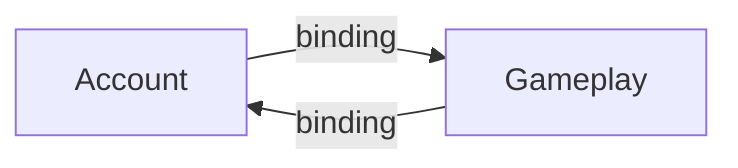

# R1 — Runtime module cycle via DI

| Field | Value |
|---|---|
| Code | `R1` |
| Class | `trigger` |
| Analyzer | `RuntimeAnalyzer` |
| Commands | `map` and `gate` (unless `knownFindings`) |

## When it fires

Union of static inter-module edges and **derived binding edges** (consumer type → implementation type from MEDI registrations). Cyclic SCCs of size ≥ 2 that are **not** set-equal to a **static** cycle (those are [B1](B1.md)) emit R1.

Fingerprint: `ForTypeEdge("R1", "Account,Gameplay", "", [])` (sorted ids). Message: `runtime cycle via DI bindings: {ids}`. Evidence is binding edges inside the SCC (`kind: binding`).

Host/test still omitted from scored modules. Registrations in tests are ignored for binding resolution the same way as other runtime rules.

## Example

No static Account ↔ Gameplay edge, but:

```csharp
// Account implementation constructor
public AccountService(Gameplay.IScore score) { }

// Gameplay implementation constructor
public ScoreService(Account.IAuth auth) { }
// both registered in the container → runtime cycle R1
```



## How to fix

Break one injection: introduce a domain event, a third module, or have the **host** compose a facade so feature modules do not inject each other’s **implementations**. Prefer injecting **contracts** in one direction only.

## What not to do

- Do **not** hide the cycle with a service locator (`GetRequiredService` in a method) — the extractor does not treat that as an injection point, so you only go dark.
- Do **not** `knownFindings` an R1 that appeared this PR. Runtime cycles are production incidents waiting to happen.

See also [R2](R2.md), [B1](B1.md), [runtime](../metrics/runtime.md).
